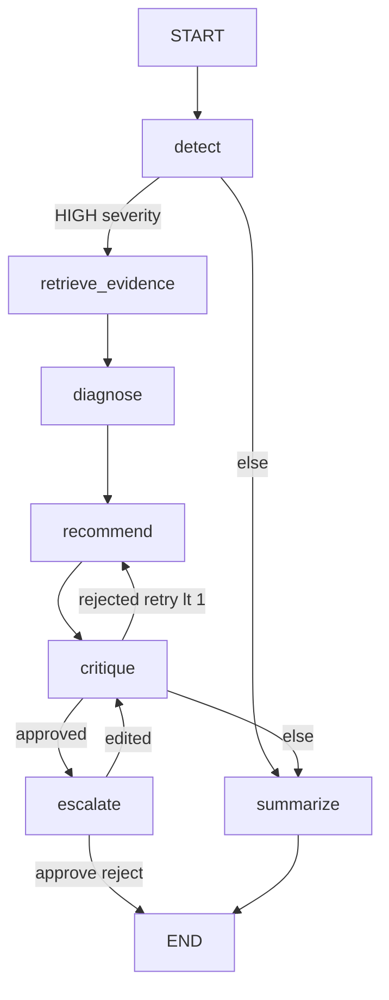
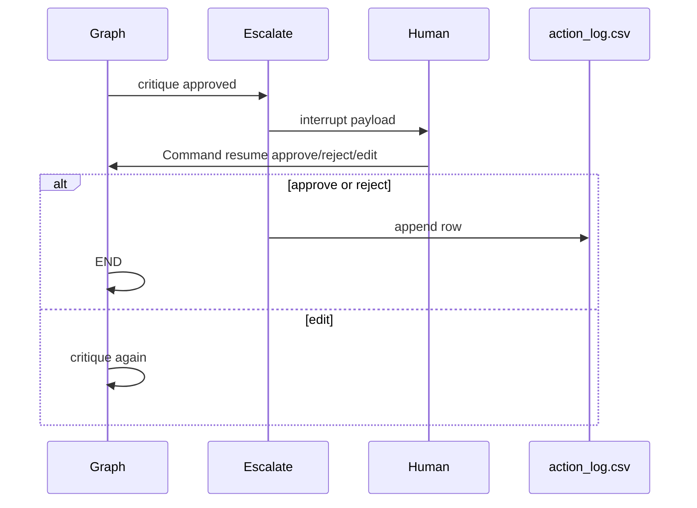
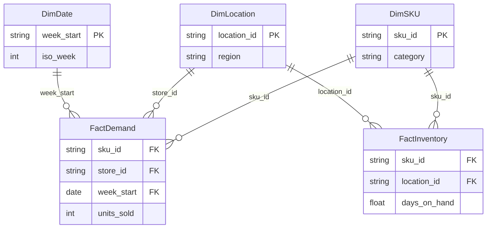

# Architecture — Supply Chain Command Center Copilot

## Graph topology

Implementation: [`src/graph/graph.py`](src/graph/graph.py)

## State schema (`SupplyChainState`)

| Field | Type | Set by |
|-------|------|--------|
| `week_start` | ISO date string | caller / `detect` |
| `sku_id`, `store_id` | optional focal keys | caller |
| `run_id` | string | caller |
| `demand_signals` | list[DemandSignal] | `detect` |
| `inventory_positions` | dict | `detect` |
| `evidence` | dict of EvidenceBlock | `retrieve_evidence` |
| `root_cause_hypotheses` | list | `diagnose` |
| `recommendations` | list | `recommend` |
| `critique_result` | CritiqueResult | `critique` |
| `approval_status` | pending/approved/rejected/edited/n/a | `escalate` |
| `exceptions` | list[str] | `summarize` |
| `retry_count` | int | `recommend` on critique retry |

Full TypedDicts: [`src/graph/state.py`](src/graph/state.py) · contract: [`interface_spec.md`](interface_spec.md)

## Routing

| Router | Rule |
|--------|------|
| `route_after_detect` | Any HIGH → `retrieve_evidence`; all flat_line → `summarize`; else `summarize` |
| `route_after_critique` | approved → `escalate`; rejected and retry&lt;1 → `recommend`; else `summarize` |
| `route_after_escalate` | edited → `critique`; else END |

Routing decisions are logged to `data/runtime/node_latency.csv` via `log_routing()`.

## HITL flow

- Checkpointer: SQLite at `data/runtime/checkpoints.db` ([`src/graph/graph.py`](src/graph/graph.py))  
- Streamlit resumes in-process ([`dashboard/components/recommendation_table.py`](dashboard/components/recommendation_table.py))  
- FastAPI `POST /approval/{run_id}` for external clients ([`src/api/routes/approval.py`](src/api/routes/approval.py))

## Tool layer

Six CSV-backed tools in [`src/tools/`](src/tools/), loaded via [`src/data/loaders.py`](src/data/loaders.py) (`lru_cache`).

| Tool | Purpose |
|------|---------|
| `demand_lookup` | Trailing demand, z-score, WoW |
| `inventory_lookup` | DOH, safety stock |
| `promo_calendar` | Active promos |
| `weather_events` | Regional events |
| `supplier_delays` | Lead time, MOQ, delays |
| `what_if_sim` | Projected DOH / stockout |

## Observability (LangSmith substitute)

[`src/graph/tracing.py`](src/graph/tracing.py) — `@log_node` on every node; `log_routing` after conditional edges.

CSV: `data/runtime/node_latency.csv` — columns include `routing_decision`.

Dashboard: [`dashboard/components/run_breakdown.py`](dashboard/components/run_breakdown.py)

## Data model (mini star schema)

- **Facts:** `demand_history.csv`, `inventory_snapshot.csv`  
- **Dims:** `sku_master.csv`, `location_master.csv`, `dim_date.csv` (from `scripts/generate_dim_date.py`)  

No FK constraints in CSV files — logical star for analytics and demos only.

## LLM

Azure OpenAI `gpt-4o-mini`, `temperature=0`, via [`src/graph/llm.py`](src/graph/llm.py).

## Evaluation

[`eval/run_evals.py`](eval/run_evals.py) loops `eval/test_cases.json`, auto-approves HITL, writes `eval/eval_results.json`. Summary: [`eval_results.md`](eval_results.md).
